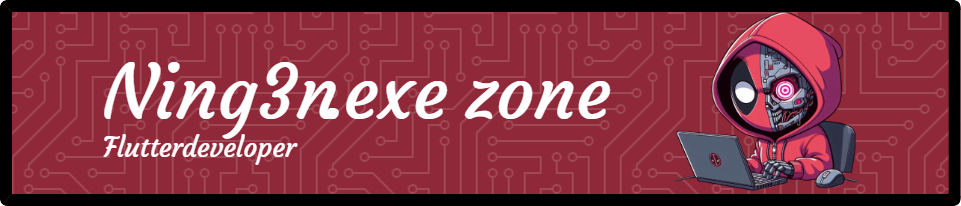

<!-- Banner estilo gamer animado -->
<h1 align="center">
  
</h1>

<!-- Presentación -->
<h1 align="center">👾 ¡Hola! Soy Miwel 👾</h1>
<h3 align="center">Desarrollador Flutter en formación y Jr Fullstack Developer. Apasionado por el código, el diseño creativo y los videojuegos 🎮</h3>

---

### 🧠 Tecnologías y lenguajes que estoy aprendiendo

  
  
  
  
  

---

### 🎯 Ideas que me gustaría desarrollar

- ✅ Aplicaciones móviles útiles y con buen diseño
- ✅ Minijuegos casuales en Flutter
- ✅ Sitios web con estilo cyberpunk/gamer
- ✅ Integraciones con Firebase para proyectos fullstack

---

### 🌐 Mis redes y contacto

  
  
  <!-- Agregá tu LinkedIn o email si querés -->

---

> 🕹️ *"Coding is my controller, the dev world is my game."* – Miwel
